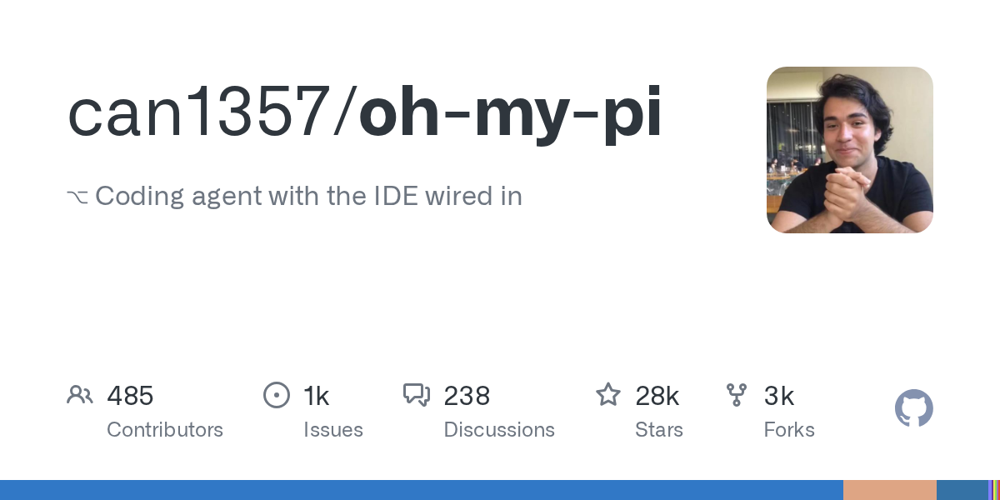

# 2026-08-28

1. **[can1357/oh-my-pi](https://github.com/can1357/oh-my-pi)** ⭐ 27.9k · TypeScript
   - 本文介绍了oh-my-pi,一个先进的AI驱动的编码代理,专为终端环境设计,专注于软件开发工作流程,它解释了oh-my-pi的目的,系统架构和关键功能,为核心组件和数据流提供技术基础和地图。
   - [deepwiki](https://deepwiki.com/can1357/oh-my-pi) · [zread](https://zread.ai/can1357/oh-my-pi)

   

---
由 daily-digest bot 自动生成
