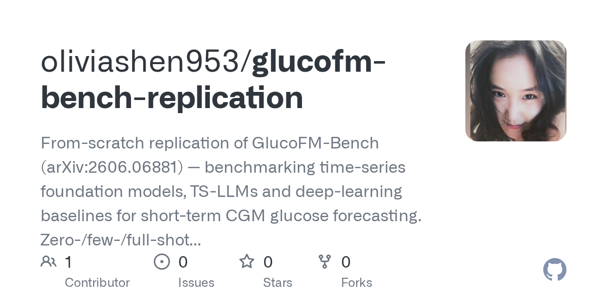

# 2026-08-28

1. **[oliviashen953/glucofm-bench-replication](https://github.com/oliviashen953/glucofm-bench-replication)** ⭐ 0 · Python
   - 从零复制GlucoFM-Bench(arXiv:2606.06881) — benchmarking时间序列基础模型,TS-LLMs和深度学习基线,用于短期CGM葡萄糖预测。
   - [deepwiki](https://deepwiki.com/oliviashen953/glucofm-bench-replication) · [zread](https://zread.ai/oliviashen953/glucofm-bench-replication)

   

---
由 daily-digest bot 自动生成
