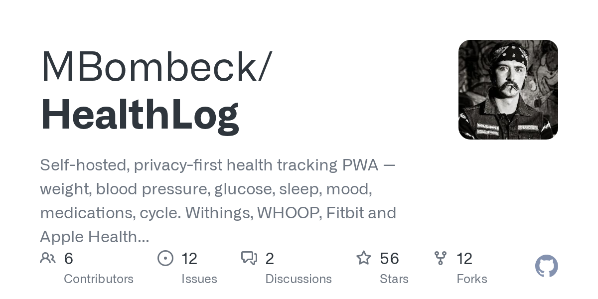

# 2026-08-28

1. **[MBombeck/HealthLog](https://github.com/MBombeck/HealthLog)** ⭐ 56 · TypeScript
   - 自我托管,隐私第一健康跟踪PWA - 体重,血压,葡萄糖,睡眠,情绪,药物,周期 Withings,WHOOP,Fitbit和苹果健康同步,你拥有的AI见解。
   - [deepwiki](https://deepwiki.com/MBombeck/HealthLog) · [zread](https://zread.ai/MBombeck/HealthLog)

   

---
由 daily-digest bot 自动生成
