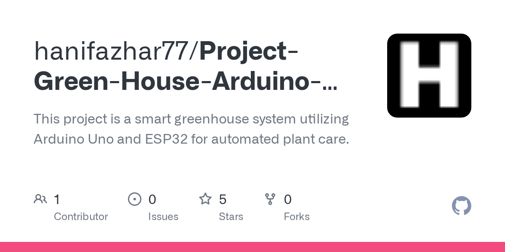

# 2026-08-29

1. **[hanifazhar77/Project-Green-House-Arduino-ESP32](https://github.com/hanifazhar77/Project-Green-House-Arduino-ESP32)** ⭐ 5 · C++
   - 该项目是一个智能温室系统,使用Arduino Uno和ESP32用于自动化工厂护理。
   - [deepwiki](https://deepwiki.com/hanifazhar77/Project-Green-House-Arduino-ESP32) · [zread](https://zread.ai/hanifazhar77/Project-Green-House-Arduino-ESP32)

   

---
由 daily-digest bot 自动生成
