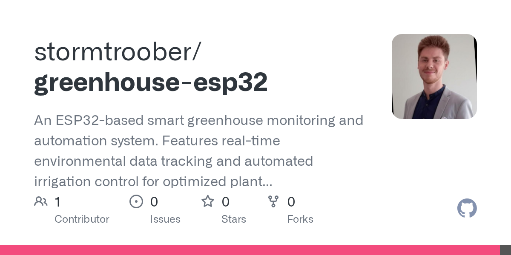

# 2026-08-29

1. **[stormtroober/greenhouse-esp32](https://github.com/stormtroober/greenhouse-esp32)** ⭐ 0 · C++
   - 基于ESP32的智能温室监测和自动化系统,提供实时环境数据跟踪和自动灌溉控制,可优化植物生长
   - [deepwiki](https://deepwiki.com/stormtroober/greenhouse-esp32) · [zread](https://zread.ai/stormtroober/greenhouse-esp32)

   

---
由 daily-digest bot 自动生成
