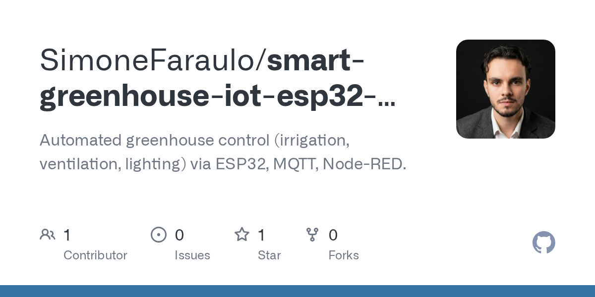

# 2026-08-29

1. **[SimoneFaraulo/smart-greenhouse-iot-esp32-nodered](https://github.com/SimoneFaraulo/smart-greenhouse-iot-esp32-nodered)** ⭐ 1 · Python
   - 自动温室控制(灌溉,通风,照明)通过ESP32,MQTT,Node-RED。
   - [deepwiki](https://deepwiki.com/SimoneFaraulo/smart-greenhouse-iot-esp32-nodered) · [zread](https://zread.ai/SimoneFaraulo/smart-greenhouse-iot-esp32-nodered)

   

---
由 daily-digest bot 自动生成
