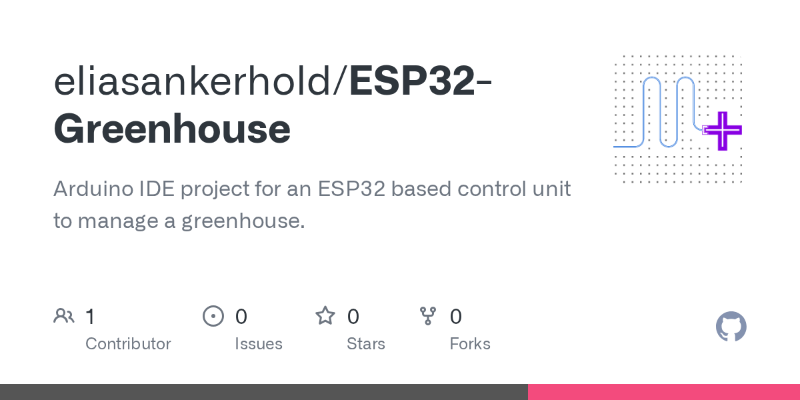

# 2026-08-29

1. **[eliasankerhold/ESP32-Greenhouse](https://github.com/eliasankerhold/ESP32-Greenhouse)** ⭐ 0 · C
   - Arduino IDE 项目为基于 ESP32 的控制单元来管理温室。
   - [deepwiki](https://deepwiki.com/eliasankerhold/ESP32-Greenhouse) · [zread](https://zread.ai/eliasankerhold/ESP32-Greenhouse)

   

---
由 daily-digest bot 自动生成
