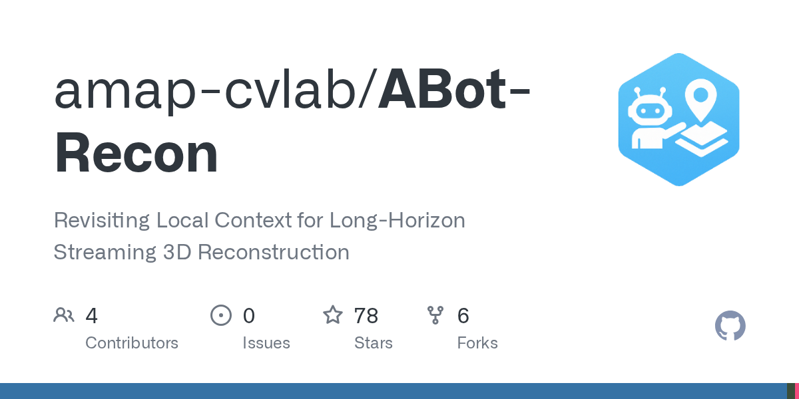

# 2026-08-29

1. **[amap-cvlab/ABot-Recon](https://github.com/amap-cvlab/ABot-Recon)** ⭐ 78 · Python
   - 重新审视 Long-Horizon 流式 3D 重建的本地背景
   - [deepwiki](https://deepwiki.com/amap-cvlab/ABot-Recon) · [zread](https://zread.ai/amap-cvlab/ABot-Recon)

   

---
由 daily-digest bot 自动生成
