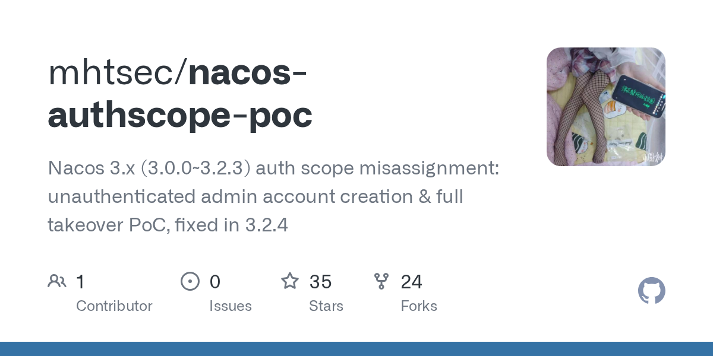

# 2026-08-29

1. **[mhtsec/nacos-authscope-poc](https://github.com/mhtsec/nacos-authscope-poc)** ⭐ 35 · Python
   - 本仓库是针对 Nacos 3.x（3.0.0 至 3.2.3 版本）中一个严重的身份验证作用域误分配漏洞的概念验证（PoC）。该漏洞允许未经身份验证的攻击者在 Nacos 服务器上创建一个等同于管理员的账户，从而有效地实现完整的服务器接管——无需任何凭据，即使运维人员已按照官方文档启用了所有身份验证设置也是如此。该 PoC 是一个单文件 Python 脚本，零第三方依赖，实现了从检测、利用到清理的完整攻击链。
   - [deepwiki](https://deepwiki.com/mhtsec/nacos-authscope-poc) · [zread](https://zread.ai/mhtsec/nacos-authscope-poc)

   

---
由 daily-digest bot 自动生成
