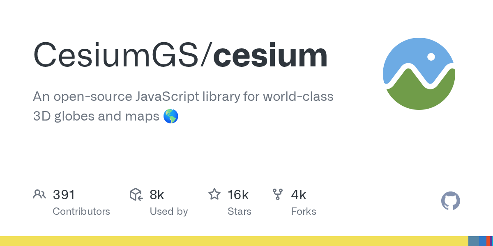

# CesiumGS/cesium · 2026-08-31

1. **[CesiumGS/cesium](https://github.com/CesiumGS/cesium)** ⭐ 15.6k · JavaScript
   - 其架构和组件组织 CesiumJS 是一个用于在 Web 浏览器中创建 3D 球和 2D 地图的 JavaScript 库,使用 WebGL 进行硬件加速的图形制作。
   - [deepwiki](https://deepwiki.com/CesiumGS/cesium) · [zread](https://zread.ai/CesiumGS/cesium)

   

---
由 daily-digest bot 自动生成
