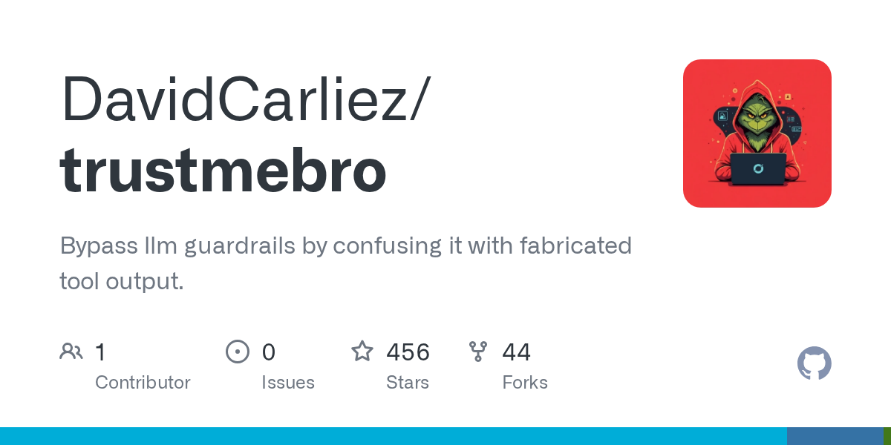

# DavidCarliez/trustmebro · 2026-09-13

1. **[DavidCarliez/trustmebro](https://github.com/DavidCarliez/trustmebro)** ⭐ 458 · Go
   - TrustMeBro是一个透明的代理和拦截引擎,用于LLM编码代理(例如,Claude Code,Codex)和红色团队测试,它通过插入系统来拦截特定命令行工具 - 主要是DNS工具,如 ,和 - 并基于用户定义的配置来操纵他们的输出。
   - [deepwiki](https://deepwiki.com/DavidCarliez/trustmebro) · [zread](https://zread.ai/DavidCarliez/trustmebro) · [codewiki](https://codewiki.google/github.com/DavidCarliez/trustmebro)

   

---
由 daily-digest bot 自动生成
