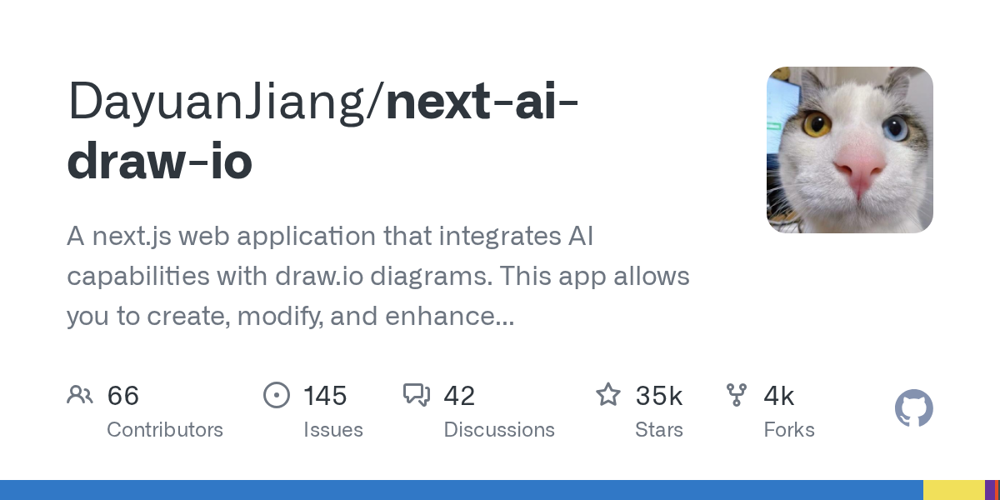

# DayuanJiang/next-ai-draw-io · 2026-08-30

1. **[DayuanJiang/next-ai-draw-io](https://github.com/DayuanJiang/next-ai-draw-io)** ⭐ 35.4k · TypeScript
   - 一个开源的AI驱动的图表创建工具,允许用户通过自然语言命令生成,修改和可视化 draw.io 图表。
   - [deepwiki](https://deepwiki.com/DayuanJiang/next-ai-draw-io) · [zread](https://zread.ai/DayuanJiang/next-ai-draw-io)

   

---
由 daily-digest bot 自动生成
