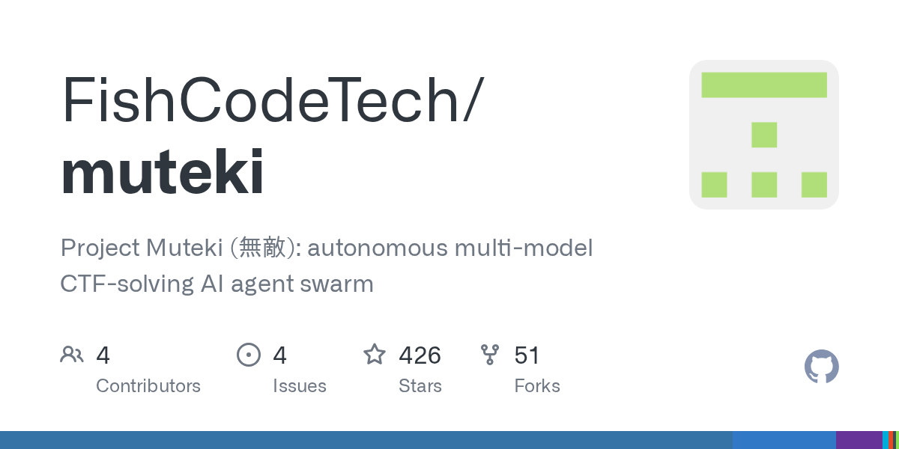

# FishCodeTech/muteki · 2026-09-03

1. **[FishCodeTech/muteki](https://github.com/FishCodeTech/muteki)** ⭐ 426 · Python
   - 無敵 · Project Muteki 是一个开源的异构多模型 AI Agent 集群，专为自主攻防安全自动化而设计。其核心解决了单 Agent 系统的一个根本局限：容易陷入死循环，以及单一模型独立工作的低效性。相反，Muteki 会调度一个协同工作的 AI 编码 Agent 集群——包括 Claude Code、OpenAI Codex 和 Cursor Agent——来应对同一个挑战，它们通过共享黑板进行协作，使得某个工作节点发现的事实能惠及全体，走过的死路绝不再重试，且只有当 Flag 确凿无疑地出现在真实执行输出中时才会被接受。
   - [deepwiki](https://deepwiki.com/FishCodeTech/muteki) · [zread](https://zread.ai/FishCodeTech/muteki) · [codewiki](https://codewiki.google/github.com/FishCodeTech/muteki)

   

---
由 daily-digest bot 自动生成
