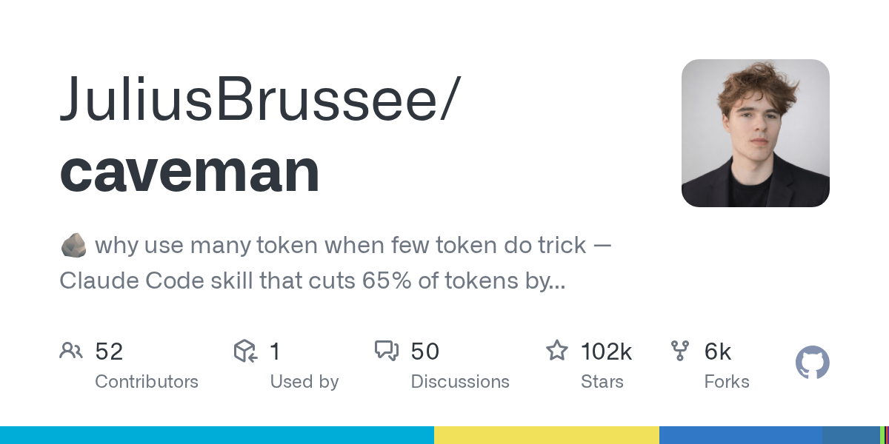

# JuliusBrussee/caveman · 2026-08-30

1. **[JuliusBrussee/caveman](https://github.com/JuliusBrussee/caveman)** ⭐ 101.8k · Go
   - Caveman 项目是一个为 AI 代理商设计的多层代币压缩系统(特别是 Claude Code、Codex、Gemini CLI 和 30 多种其他项目)。
   - [deepwiki](https://deepwiki.com/JuliusBrussee/caveman) · [zread](https://zread.ai/JuliusBrussee/caveman)

   

---
由 daily-digest bot 自动生成
