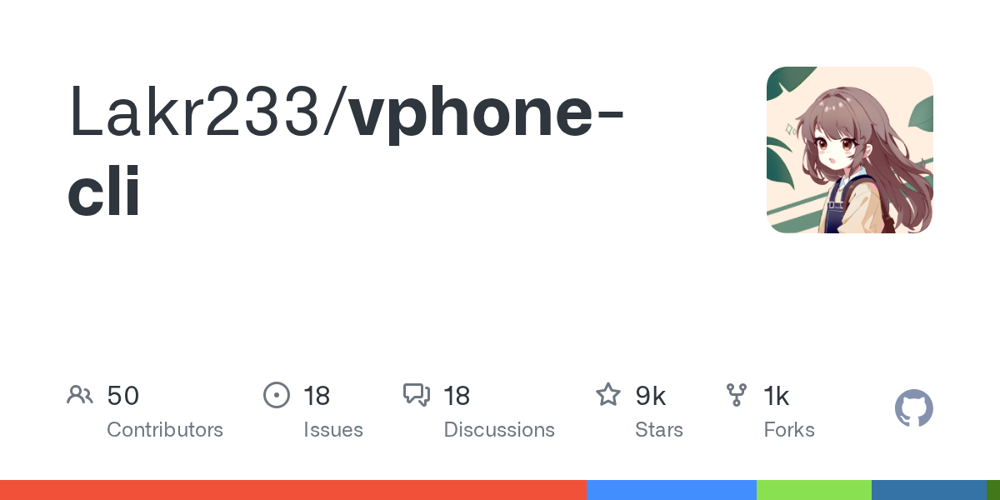

# Lakr233/vphone-cli · 2026-08-30

1. **[Lakr233/vphone-cli](https://github.com/Lakr233/vphone-cli)** ⭐ 9.4k · Swift
   - 此页面描述了它是什么,它解决了哪些问题,涉及的关键术语,以及连接其主要子系统的高级别架构. 有关逐步设置的说明,请参阅先决条件和主机设置。
   - [deepwiki](https://deepwiki.com/Lakr233/vphone-cli) · [zread](https://zread.ai/Lakr233/vphone-cli)

   

---
由 daily-digest bot 自动生成
