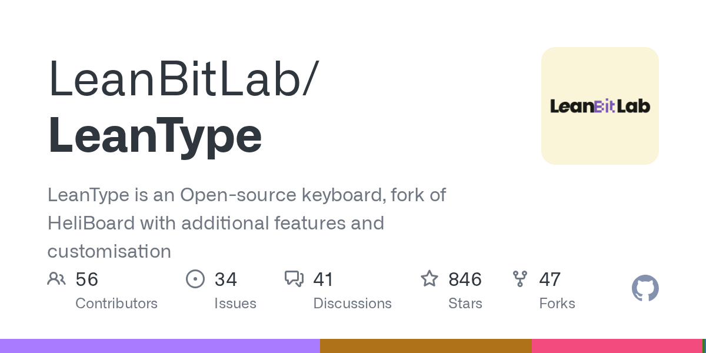

# LeanBitLab/LeanType · 2026-08-30

1. **[LeanBitLab/LeanType](https://github.com/LeanBitLab/LeanType)** ⭐ 846 · Kotlin
   - LeanType是一个开源的键盘,HeliBoard的叉子具有额外的功能和定制
   - [deepwiki](https://deepwiki.com/LeanBitLab/LeanType) · [zread](https://zread.ai/LeanBitLab/LeanType)

   

---
由 daily-digest bot 自动生成
