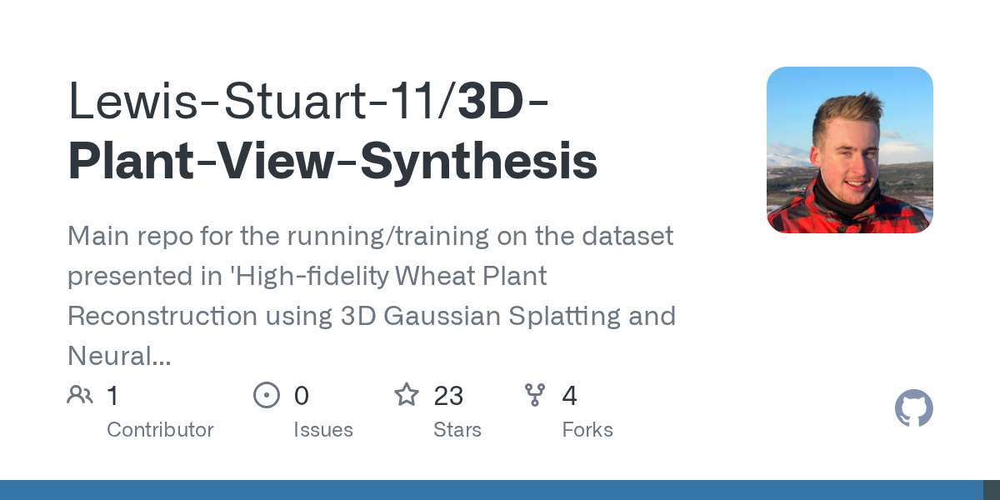

# Lewis-Stuart-11/3D-Plant-View-Synthesis · 2026-09-02

1. **[Lewis-Stuart-11/3D-Plant-View-Synthesis](https://github.com/Lewis-Stuart-11/3D-Plant-View-Synthesis)** ⭐ 23 · Python
   - 在“使用3D Gaussian Splatting和神经辐射场的高忠实小麦植物重建”中展示的数据集上的跑步/训练的主要复制
   - [deepwiki](https://deepwiki.com/Lewis-Stuart-11/3D-Plant-View-Synthesis) · [zread](https://zread.ai/Lewis-Stuart-11/3D-Plant-View-Synthesis) · [codewiki](https://codewiki.google/github.com/Lewis-Stuart-11/3D-Plant-View-Synthesis)

   

---
由 daily-digest bot 自动生成
