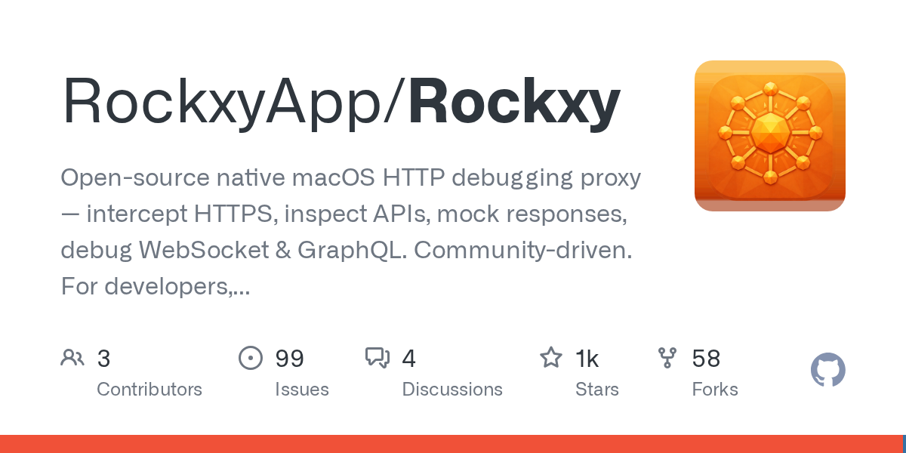

# RockxyApp/Rockxy · 2026-08-29

1. **[RockxyApp/Rockxy](https://github.com/RockxyApp/Rockxy)** ⭐ 1.0k · Swift
   - Rockxy 是一个可审核的开源 HTTP 调试代理程序,适用于 macOS,它是由 Swift 创建的,它提供了一个本地化工作流程,用于拦截、检查和修改 HTTP、HTTPS、WebSocket 和 GraphQL 流量 README.md:18-23. Rockxy 作为专有工具的透明替代方案,通过“建立它自己”的信任模型和本地的 macOS 体验来强调安全性。
   - [deepwiki](https://deepwiki.com/RockxyApp/Rockxy) · [zread](https://zread.ai/RockxyApp/Rockxy)

   

---
由 daily-digest bot 自动生成
