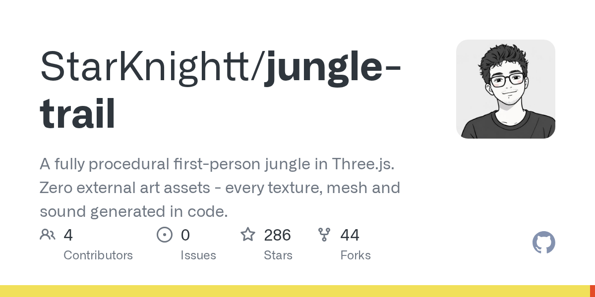

# StarKnightt/jungle-trail · 2026-09-02

1. **[StarKnightt/jungle-trail](https://github.com/StarKnightt/jungle-trail)** ⭐ 286 · JavaScript
   - Jungle Trail 项目是一个在 Three.js 中构建的第一人称探索体验,其特点是“零外部资产”的哲学,每个纹理、网格和声音都通过GLSL和Web Audio API在运行时进行程序生成。
   - [deepwiki](https://deepwiki.com/StarKnightt/jungle-trail) · [zread](https://zread.ai/StarKnightt/jungle-trail) · [codewiki](https://codewiki.google/github.com/StarKnightt/jungle-trail)

   

---
由 daily-digest bot 自动生成
