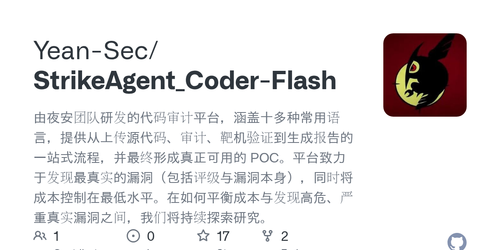

# Yean-Sec/StrikeAgent_Coder-Flash · 2026-09-15

1. **[Yean-Sec/StrikeAgent_Coder-Flash](https://github.com/Yean-Sec/StrikeAgent_Coder-Flash)** ⭐ 17 · TypeScript
   - 由夜安团队研发的代码审计平台，涵盖十多种常用语言，提供从上传源代码、审计、靶机验证到生成报告的一站式流程，并最终形成真正可用的 POC。平台致力于发现最真实的漏洞（包括评级与漏洞本身），同时将成本控制在最低水平。在如何平衡成本与发现高危、严重真实漏洞之间，我们将持续探索研究。
   - [deepwiki](https://deepwiki.com/Yean-Sec/StrikeAgent_Coder-Flash) · [zread](https://zread.ai/Yean-Sec/StrikeAgent_Coder-Flash) · [codewiki](https://codewiki.google/github.com/Yean-Sec/StrikeAgent_Coder-Flash)

   

---
由 daily-digest bot 自动生成
