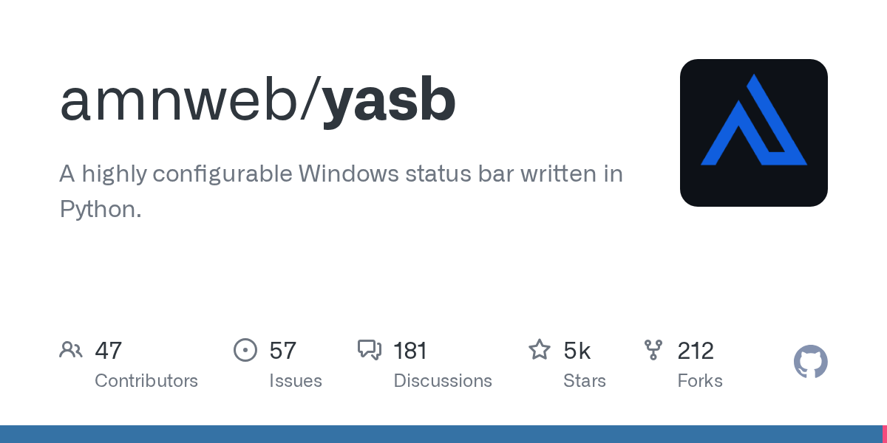

# amnweb/yasb · 2026-09-08

1. **[amnweb/yasb](https://github.com/amnweb/yasb)** ⭐ 5.4k · Python
   - 此页面记录了 YASB 文件中的根级配置选项,这些选项控制了整个应用程序的行为,包括文件观看、调试模式、更新检查和外部集成。
   - [deepwiki](https://deepwiki.com/amnweb/yasb) · [zread](https://zread.ai/amnweb/yasb) · [codewiki](https://codewiki.google/github.com/amnweb/yasb)

   

---
由 daily-digest bot 自动生成
