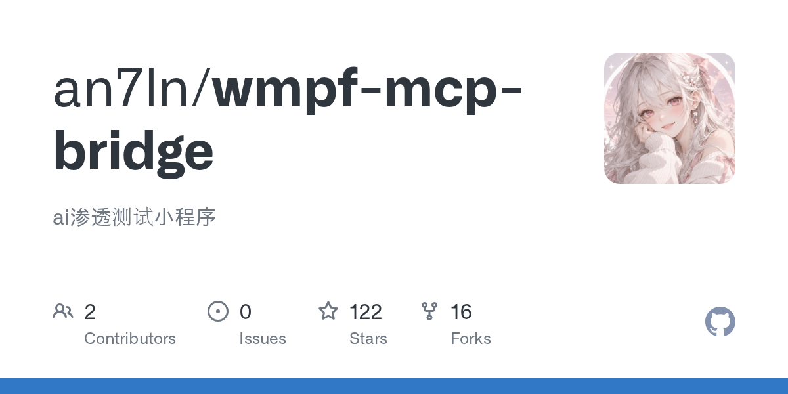

# an7ln/wmpf-mcp-bridge · 2026-09-28

1. **[an7ln/wmpf-mcp-bridge](https://github.com/an7ln/wmpf-mcp-bridge)** ⭐ 122 · TypeScript
   - 这是一个专门的模型背景协议(MCP)服务器,旨在弥合人工智能驱动的安全评估工具(如Codex,Cursor或VS代码代理)和WeChat小程序框架(WMPF)调试器之间的差距。
   - [deepwiki](https://deepwiki.com/an7ln/wmpf-mcp-bridge) · [zread](https://zread.ai/an7ln/wmpf-mcp-bridge) · [codewiki](https://codewiki.google/github.com/an7ln/wmpf-mcp-bridge)

   

---
由 daily-digest bot 自动生成
