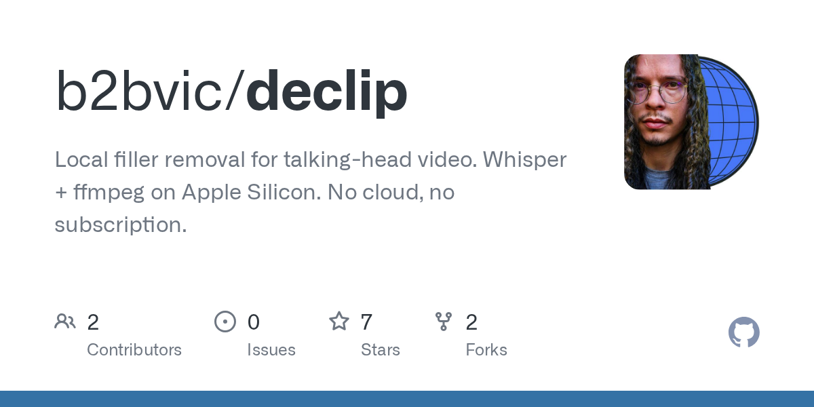

# b2bvic/declip · 2026-08-30

1. **[b2bvic/declip](https://github.com/b2bvic/declip)** ⭐ 7 · Python
   - 用于聊天头部视频的本地填充器移除。在苹果硅上微笑 + ffmpeg. 没有云,没有订阅。
   - [deepwiki](https://deepwiki.com/b2bvic/declip) · [zread](https://zread.ai/b2bvic/declip)

   

---
由 daily-digest bot 自动生成
