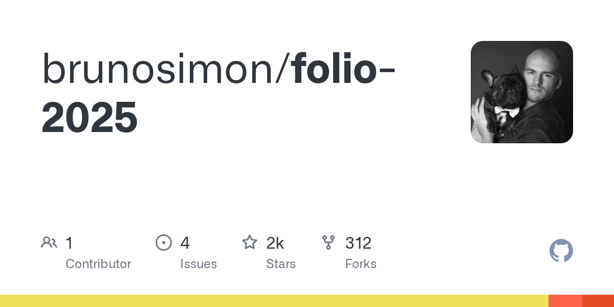

# brunosimon/folio-2025 · 2026-09-02

1. **[brunosimon/folio-2025](https://github.com/brunosimon/folio-2025)** ⭐ 1.8k · JavaScript
   - 一个3D交互式组合体验,作为Web应用程序构建,该组合允许用户通过驾驶基于物理的车辆,发现内容区域,与对象进行交互,并解锁成就来探索一个程序生成的世界。
   - [deepwiki](https://deepwiki.com/brunosimon/folio-2025) · [zread](https://zread.ai/brunosimon/folio-2025) · [codewiki](https://codewiki.google/github.com/brunosimon/folio-2025)

   

---
由 daily-digest bot 自动生成
