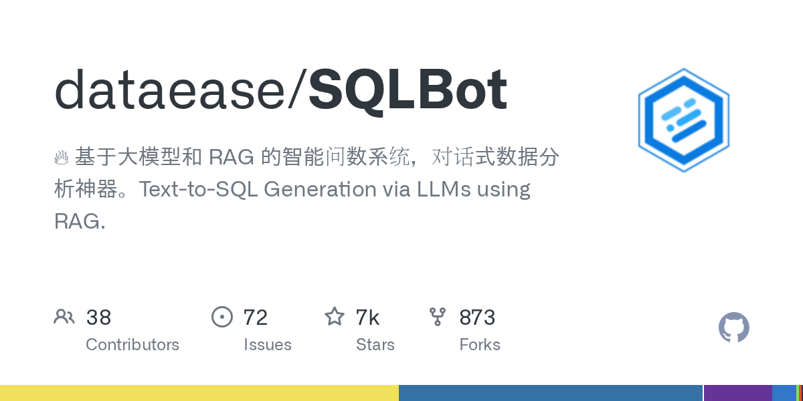

# dataease/SQLBot · 2026-09-14

1. **[dataease/SQLBot](https://github.com/dataease/SQLBot)** ⭐ 6.8k · JavaScript
   - SQLBot 是一个智能数据查询系统,通过自然语言问题实现对话数据分析(ChatBI),该系统利用 Large Language Models (LLM) 和 Retrieval-Augmented Generation (RAG) 将用户查询转换为 SQL 查询,对连接的数据库执行,生成可视化和提供数据见解。
   - [deepwiki](https://deepwiki.com/dataease/SQLBot) · [zread](https://zread.ai/dataease/SQLBot) · [codewiki](https://codewiki.google/github.com/dataease/SQLBot)

   

---
由 daily-digest bot 自动生成
