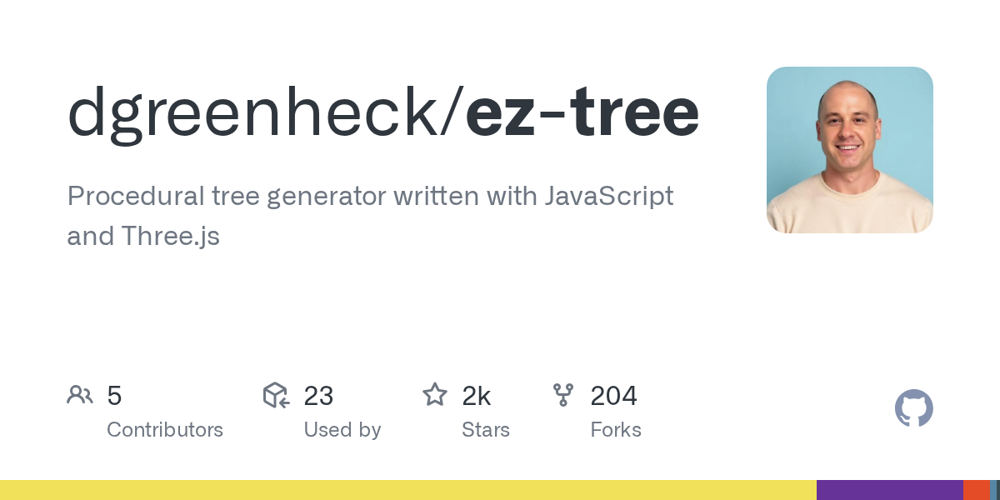

# dgreenheck/ez-tree · 2026-09-02

1. **[dgreenheck/ez-tree](https://github.com/dgreenheck/ez-tree)** ⭐ 1.6k · JavaScript
   - 一个程序树生成系统,包括可重复使用的JavaScript库和功能齐全的Web应用程序,此概述解释了项目的目的、架构、核心组件以及它们如何相互关联。
   - [deepwiki](https://deepwiki.com/dgreenheck/ez-tree) · [zread](https://zread.ai/dgreenheck/ez-tree) · [codewiki](https://codewiki.google/github.com/dgreenheck/ez-tree)

   

---
由 daily-digest bot 自动生成
