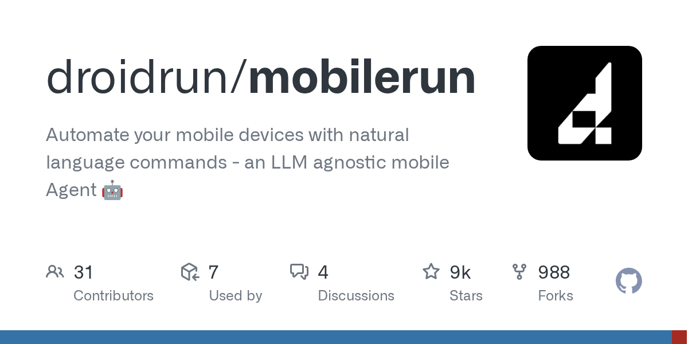

# droidrun/mobilerun · 2026-09-05

1. **[droidrun/mobilerun](https://github.com/droidrun/mobilerun)** ⭐ 9.2k · Python
   - Mobilerun 是一个技术框架,旨在缩小大型语言模型(LLM)和移动操作系统之间的差距,它允许开发人员使用自然语言控制 Android 和 iOS 设备,将高级别的意图转化为精确的 UI 交互 README.md:41-45.
   - [deepwiki](https://deepwiki.com/droidrun/mobilerun) · [zread](https://zread.ai/droidrun/mobilerun) · [codewiki](https://codewiki.google/github.com/droidrun/mobilerun)

   

---
由 daily-digest bot 自动生成
