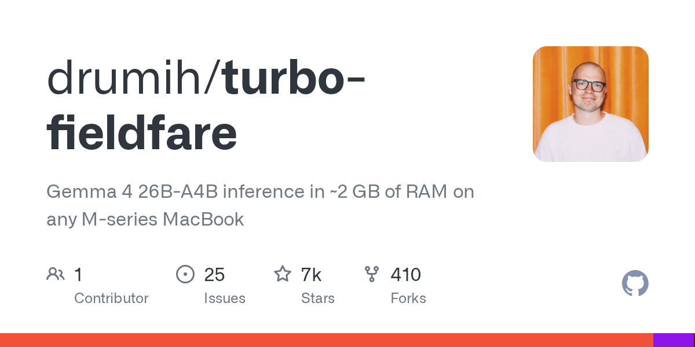

# drumih/turbo-fieldfare · 2026-09-02

1. **[drumih/turbo-fieldfare](https://github.com/drumih/turbo-fieldfare)** ⭐ 6.5k · Swift
   - TurboFieldfare 是一个专门的 Swift 和 Metal 运行时间,旨在在在有限内存的 Apple 硅硬件上运行 Gemma 4 26B-A4B 专家组合 (MoE) 模型 README.md:8-10. 虽然该模型的单文安装需要大约 14.3 GB 的存储空间,但 TurboFieldfare 允许在 ~ 2 GB RAM 预算内推断 README.md:30-37.
   - [deepwiki](https://deepwiki.com/drumih/turbo-fieldfare) · [zread](https://zread.ai/drumih/turbo-fieldfare) · [codewiki](https://codewiki.google/github.com/drumih/turbo-fieldfare)

   

---
由 daily-digest bot 自动生成
