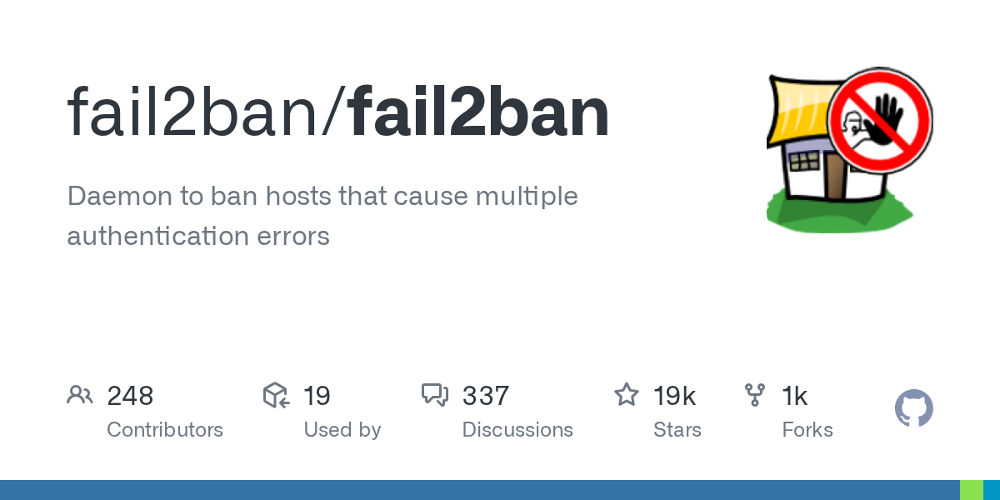

# fail2ban/fail2ban · 2026-09-08

1. **[fail2ban/fail2ban](https://github.com/fail2ban/fail2ban)** ⭐ 18.6k · Python
   - Fail2Ban是一个侵入预防系统(IPS),保护计算机服务器免受暴力攻击和其他恶意活动。它通过扫描日志文件(例如, , )或监控系统日志,以检测未成功的身份验证尝试或可疑行为的模式。
   - [deepwiki](https://deepwiki.com/fail2ban/fail2ban) · [zread](https://zread.ai/fail2ban/fail2ban) · [codewiki](https://codewiki.google/github.com/fail2ban/fail2ban)

   

---
由 daily-digest bot 自动生成
