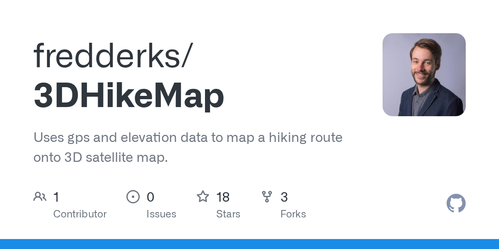

# fredderks/3DHikeMap · 2026-08-31

1. **[fredderks/3DHikeMap](https://github.com/fredderks/3DHikeMap)** ⭐ 18 · R
   - 使用 gps 和高度数据将徒步路线绘制到 3D 卫星地图上。
   - [deepwiki](https://deepwiki.com/fredderks/3DHikeMap) · [zread](https://zread.ai/fredderks/3DHikeMap)

   

---
由 daily-digest bot 自动生成
