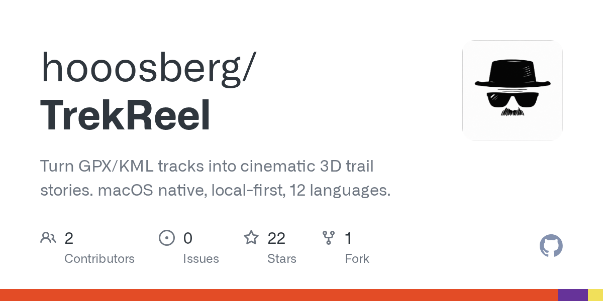

# hooosberg/TrekReel · 2026-08-31

1. **[hooosberg/TrekReel](https://github.com/hooosberg/TrekReel)** ⭐ 22 · HTML
   - 欢迎来到 TrekReel 文档。本指南涵盖了 hooosberg/TrekReel 仓库的 gh-pages 分支 —— 这是一个静态营销网站，用于介绍 TrekReel（一款面向户外爱好者的本地优先 3D 故事叙述应用）。该站点使用原生 HTML、CSS 和 JavaScript 构建，零构建工具依赖，却能在 12 种语言 中提供精致的 Apple 风格体验。本页面向你概述全貌：项目是什么、结构如何，以及接下来可以去哪。
   - [deepwiki](https://deepwiki.com/hooosberg/TrekReel) · [zread](https://zread.ai/hooosberg/TrekReel)

   

---
由 daily-digest bot 自动生成
