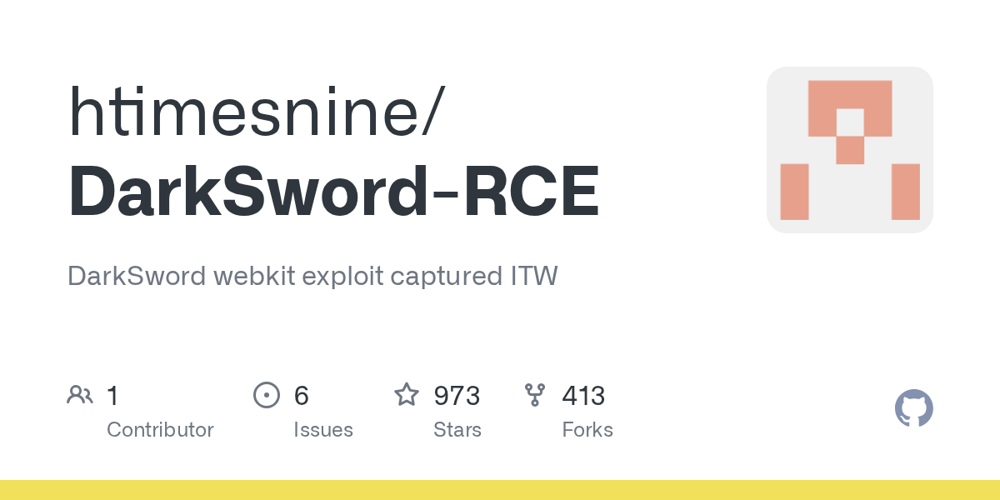

# htimesnine/DarkSword-RCE · 2026-09-19

1. **[htimesnine/DarkSword-RCE](https://github.com/htimesnine/DarkSword-RCE)** ⭐ 973 · JavaScript
   - DarkSword exploit 链是一个复杂的,多阶段的网络间谍工具包,针对 iOS 设备(特别是版本 18.4 到 18.6.2)它利用 WebKit 的 JavaScriptCore (JSC) 引擎和 macOS/iOS 内核级驱动程序中的一系列漏洞,从远程的基于 Web 的入口点实现完整的系统损害。
   - [deepwiki](https://deepwiki.com/htimesnine/DarkSword-RCE) · [zread](https://zread.ai/htimesnine/DarkSword-RCE) · [codewiki](https://codewiki.google/github.com/htimesnine/DarkSword-RCE)

   

---
由 daily-digest bot 自动生成
