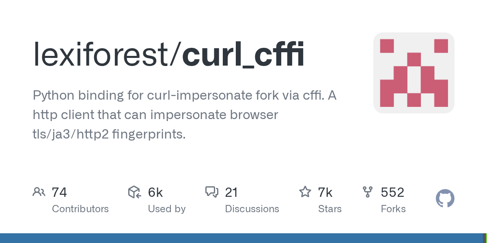

# lexiforest/curl_cffi · 2026-09-22

1. **[lexiforest/curl_cffi](https://github.com/lexiforest/curl_cffi)** ⭐ 6.5k · Python
   - curl_cffi 是一款强大的 Python HTTP 客户端库，其独特之处在于能够模拟浏览器指纹。与传统的 requests 或 httpx 等 HTTP 客户端不同，curl_cffi 可以模仿主流浏览器的 TLS/JA3 和 HTTP/2 指纹，当您遇到无明显原因就屏蔽标准 HTTP 客户端的网站时，它便成为不可或缺的工具。
   - [deepwiki](https://deepwiki.com/lexiforest/curl_cffi) · [zread](https://zread.ai/lexiforest/curl_cffi) · [codewiki](https://codewiki.google/github.com/lexiforest/curl_cffi)

   

---
由 daily-digest bot 自动生成
