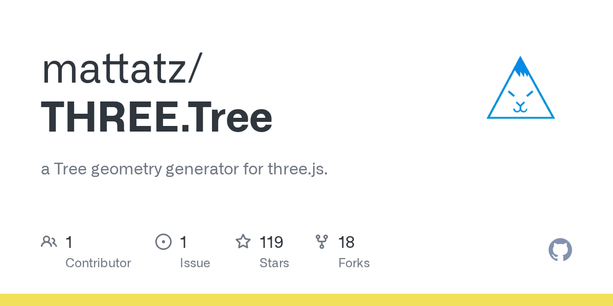

# mattatz/THREE.Tree · 2026-09-02

1. **[mattatz/THREE.Tree](https://github.com/mattatz/THREE.Tree)** ⭐ 119 · JavaScript
   - 三.js 的木材地理发电器。
   - [deepwiki](https://deepwiki.com/mattatz/THREE.Tree) · [zread](https://zread.ai/mattatz/THREE.Tree) · [codewiki](https://codewiki.google/github.com/mattatz/THREE.Tree)

   

---
由 daily-digest bot 自动生成
