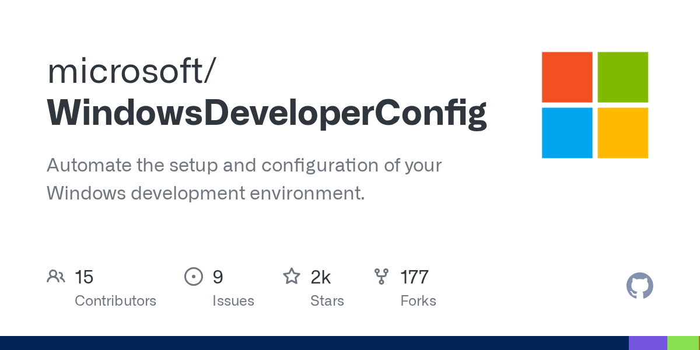

# microsoft/WindowsDeveloperConfig · 2026-09-28

1. **[microsoft/WindowsDeveloperConfig](https://github.com/microsoft/WindowsDeveloperConfig)** ⭐ 2.5k · PowerShell
   - Windows Developer Config 存储库提供已知的、声明的和可行的配置,以便将新的 Windows 安装转化为一个功能齐全的开发人员工作站。
   - [deepwiki](https://deepwiki.com/microsoft/WindowsDeveloperConfig) · [zread](https://zread.ai/microsoft/WindowsDeveloperConfig) · [codewiki](https://codewiki.google/github.com/microsoft/WindowsDeveloperConfig)

   

---
由 daily-digest bot 自动生成
