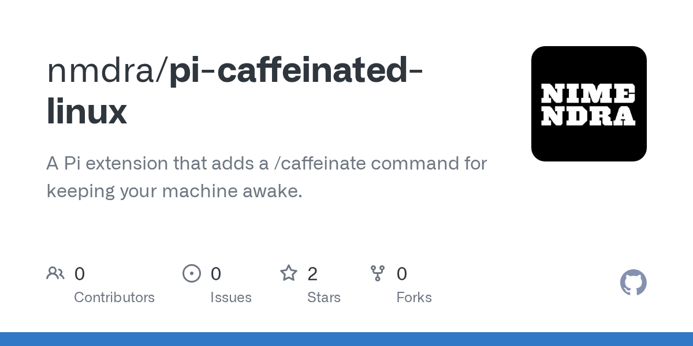

# nmdra/pi-caffeinated-linux · 2026-09-04

1. **[nmdra/pi-caffeinated-linux](https://github.com/nmdra/pi-caffeinated-linux)** ⭐ 2 · TypeScript
   - 一个Pi扩展,添加一个 /caffeinate命令来保持你的机器清醒。
   - [deepwiki](https://deepwiki.com/nmdra/pi-caffeinated-linux) · [zread](https://zread.ai/nmdra/pi-caffeinated-linux) · [codewiki](https://codewiki.google/github.com/nmdra/pi-caffeinated-linux)

   

---
由 daily-digest bot 自动生成
