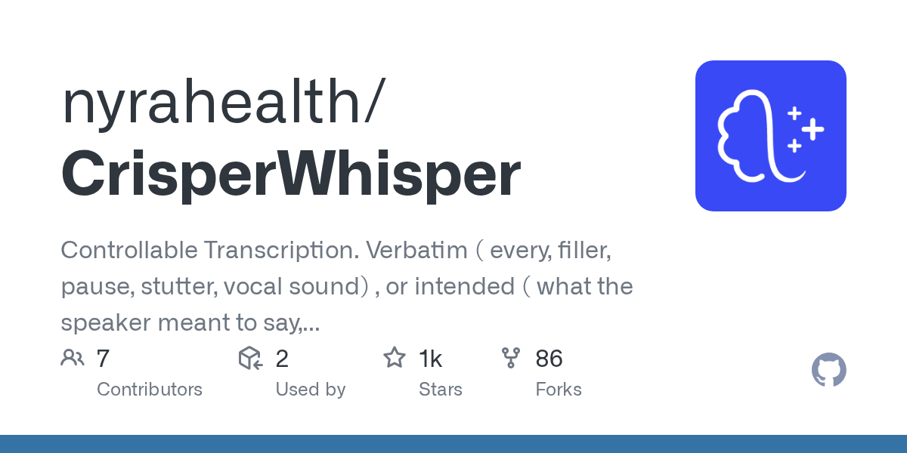

# nyrahealth/CrisperWhisper · 2026-08-30

1. **[nyrahealth/CrisperWhisper](https://github.com/nyrahealth/CrisperWhisper)** ⭐ 1.4k · Python
   - CrisperWhisper是一个先进的语音识别系统,作为OpenAI的Whisper模型的改进版构建,CrisperWhisper专门用于快速,准确和口头识别,使用准确的(“crisp”)字层时刻印。
   - [deepwiki](https://deepwiki.com/nyrahealth/CrisperWhisper) · [zread](https://zread.ai/nyrahealth/CrisperWhisper)

   

---
由 daily-digest bot 自动生成
