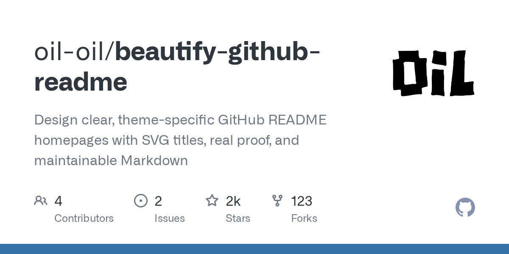

# oil-oil/beautify-github-readme · 2026-09-06

1. **[oil-oil/beautify-github-readme](https://github.com/oil-oil/beautify-github-readme)** ⭐ 1.7k · Python
   - 该项目提供了一个专门的技能,旨在让AI代理人将标准的信息密集的GitHub READMEs转化为清晰的,高转换的定位页面,它超越了通用模板,通过直接从库的自身文物(如代码片段,UI屏幕截图或数据结构README.md:58-61)中提取一个“项目原生”的视觉系统。
   - [deepwiki](https://deepwiki.com/oil-oil/beautify-github-readme) · [zread](https://zread.ai/oil-oil/beautify-github-readme) · [codewiki](https://codewiki.google/github.com/oil-oil/beautify-github-readme)

   

---
由 daily-digest bot 自动生成
