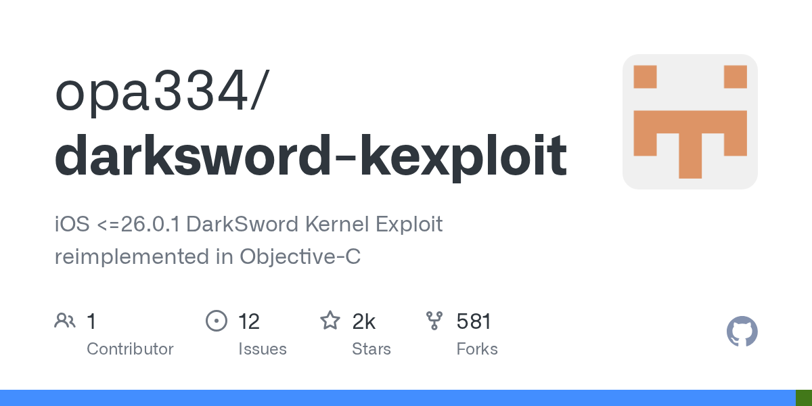

# opa334/darksword-kexploit · 2026-09-19

1. **[opa334/darksword-kexploit](https://github.com/opa334/darksword-kexploit)** ⭐ 1.5k · Objective-C
   - DarksSword是一个在iOS-C中重新实现的iOS内核漏洞利用项目。它针对的是iOS 15.0和16.0.1之间的漏洞窗口README.md：5-5。该项目通过利用涉及和物理内存映射的竞争条件来提供内核读/写（KRW）原语的功能实现。
   - [deepwiki](https://deepwiki.com/opa334/darksword-kexploit) · [zread](https://zread.ai/opa334/darksword-kexploit) · [codewiki](https://codewiki.google/github.com/opa334/darksword-kexploit)

   

---
由 daily-digest bot 自动生成
