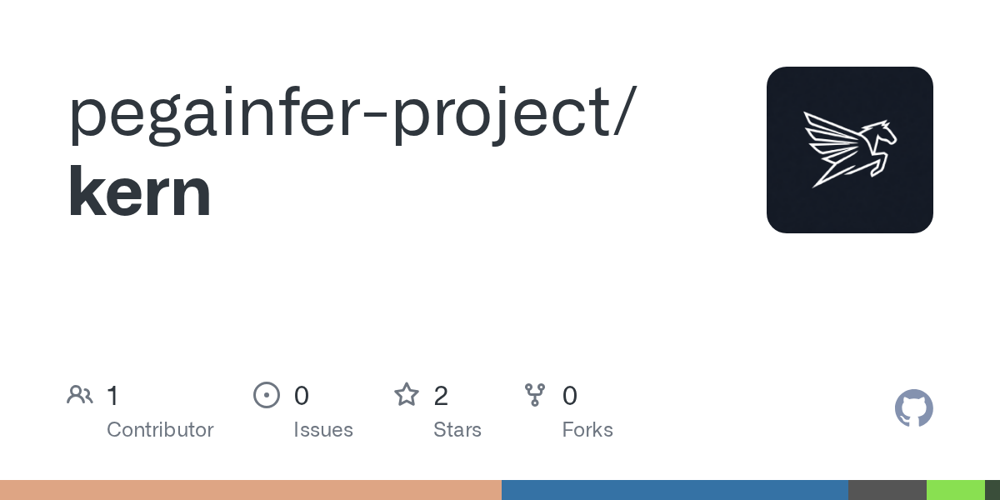

# pegainfer-project/kern · 2026-08-30

1. **[pegainfer-project/kern](https://github.com/pegainfer-project/kern)** ⭐ 2 · Rust
   - 该项目是一个模型无效的 GPU 可执行的运行时间,旨在将模型特定的逻辑与服务基础设施分开,而不是将模型架构(如 Qwen、Llama 或 Mamba)直接嵌入到推断引擎中,而是使用数据驱动的执行机制 design.md:17-27.
   - [deepwiki](https://deepwiki.com/pegainfer-project/kern) · [zread](https://zread.ai/pegainfer-project/kern)

   

---
由 daily-digest bot 自动生成
