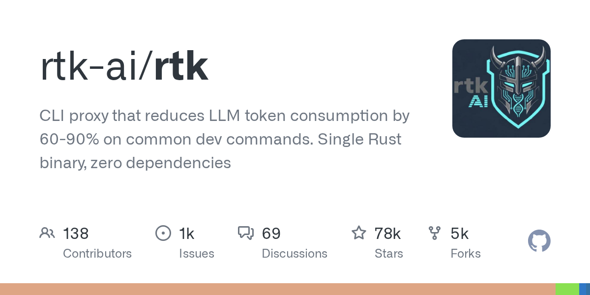

# rtk-ai/rtk · 2026-08-30

1. **[rtk-ai/rtk](https://github.com/rtk-ai/rtk)** ⭐ 77.9k · Rust
   - RTK(Rust Token Killer)是一个高性能的CLI代理程序,通过智能输出过滤来减少LLM代币的消耗量60～90%。本页面为RTK的架构、核心功能和设计原则提供了高级别的介绍。
   - [deepwiki](https://deepwiki.com/rtk-ai/rtk) · [zread](https://zread.ai/rtk-ai/rtk)

   

---
由 daily-digest bot 自动生成
