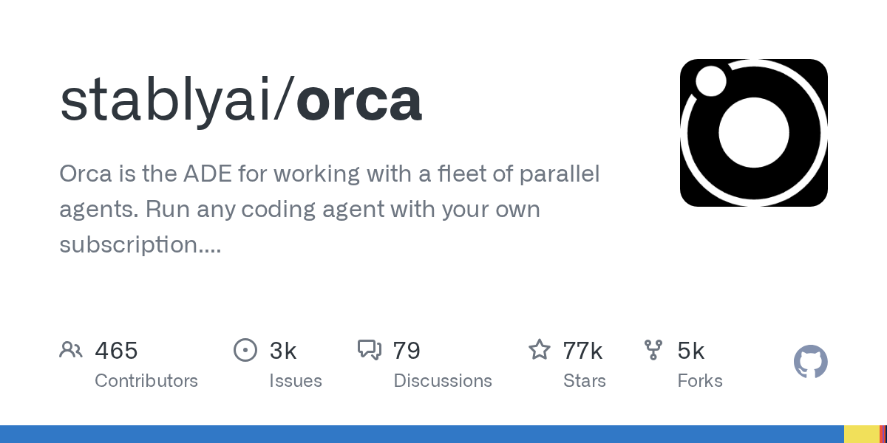

# stablyai/orca · 2026-09-24

1. **[stablyai/orca](https://github.com/stablyai/orca)** ⭐ 77.2k · TypeScript
   - Orca 是一款跨平台的 AI Orchestrator 和 IDE,旨在为开发人员管理跨多个 git 存储库和工作区的复杂工作流程,提供一个统一的界面,用于运行 AI 编码代理(如 Claude Code、Codex、OpenCode 或 Pi)一边一边 - 每个在其独立的 git 工作区环境中 - 允许比较、合并和无缝的并行功能开发。
   - [deepwiki](https://deepwiki.com/stablyai/orca) · [zread](https://zread.ai/stablyai/orca) · [codewiki](https://codewiki.google/github.com/stablyai/orca)

   

---
由 daily-digest bot 自动生成
