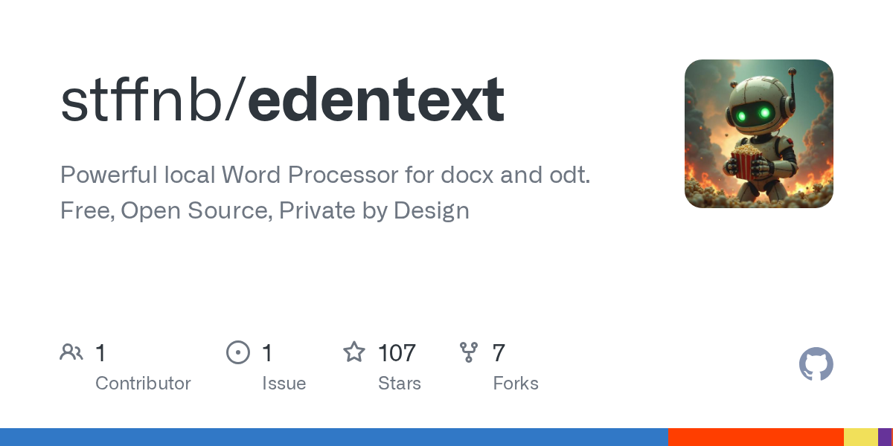

# stffnb/edentext · 2026-09-21

1. **[stffnb/edentext](https://github.com/stffnb/edentext)** ⭐ 108 · TypeScript
   - 强大的本地 Word 处理器为 docx 和 odt. 免费,开源,私人设计
   - [deepwiki](https://deepwiki.com/stffnb/edentext) · [zread](https://zread.ai/stffnb/edentext) · [codewiki](https://codewiki.google/github.com/stffnb/edentext)

   

---
由 daily-digest bot 自动生成
