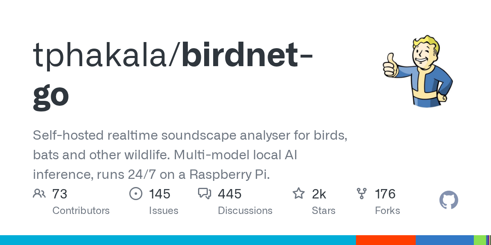

# tphakala/birdnet-go · 2026-09-17

1. **[tphakala/birdnet-go](https://github.com/tphakala/birdnet-go)** ⭐ 2.1k · Go
   - BirdNET-Go 是一个自有、实时的鸟类声音识别系统,使用 BirdNET AI 模型分析麦克风和网络流的音频,该应用程序以一个单一的二进制形式分布,具有嵌入式前端资产,不需要外部依赖之外的可选 FFmpeg/SoX 音频处理。
   - [deepwiki](https://deepwiki.com/tphakala/birdnet-go) · [zread](https://zread.ai/tphakala/birdnet-go) · [codewiki](https://codewiki.google/github.com/tphakala/birdnet-go)

   

---
由 daily-digest bot 自动生成
