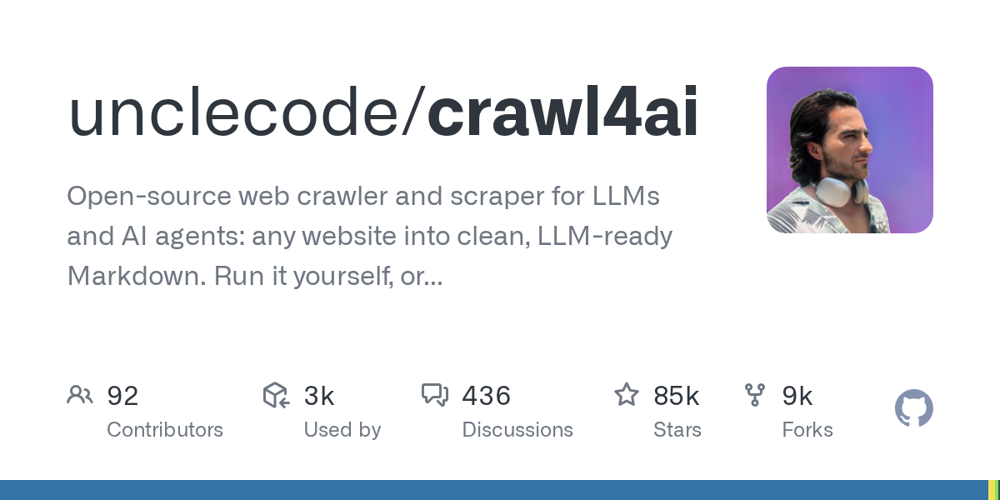

# unclecode/crawl4ai · 2026-10-04

1. **[unclecode/crawl4ai](https://github.com/unclecode/crawl4ai)** ⭐ 84.7k · Python
   - Crawl4AI 是一个开源、对 LLM 友好的网页爬取与解析工具，它将网页转化为干净、结构化的 Markdown —— 专为 RAG 流水线、AI 智能体和数据提取工作流而构建。在 0.9.2 版本中，它已获得 50K+ Star 社区的实战检验，并围绕一个核心架构原则进行设计：每个网页都应生成结构化、无噪声的输出，而无需编写脆弱的爬取代码。
   - [deepwiki](https://deepwiki.com/unclecode/crawl4ai) · [zread](https://zread.ai/unclecode/crawl4ai) · [codewiki](https://codewiki.google/github.com/unclecode/crawl4ai)

   

---
由 daily-digest bot 自动生成
