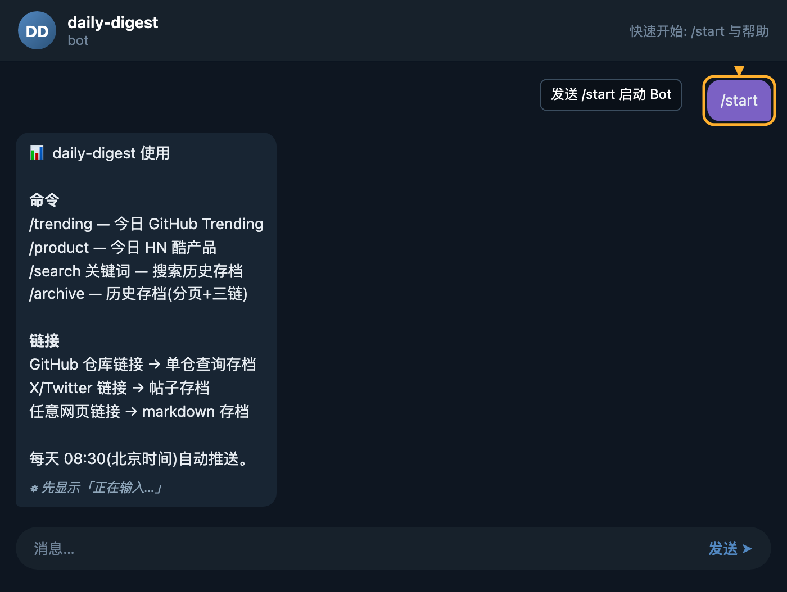

### 步骤 1: 添加 Bot 并进入对话

在 Telegram 中搜索并打开 daily-digest Bot,点击 **开始** 或 **Start** 按钮,即可与 Bot 建立对话。首次添加时,Telegram 会自动向 Bot 发送 `/start` 命令,Bot 随即向你推送欢迎信息与功能菜单,无需额外操作。

### 步骤 2: 接收 Bot 的欢迎菜单

Bot 收到 `/start`(或任意不在分支中的文本)后,会返回一段结构化的使用说明,包含四类核心命令与支持的链接类型说明。该消息是后续所有操作的入口地图,建议先完整阅读一遍再开始使用。

返回内容示例如下:

> 📊 daily-digest 使用
>
> 命令
> - `/trending` — 今日 GitHub Trending
> - `/product` — 今日 HN 酷产品
> - `/search 关键词` — 搜索历史存档
> - `/archive` — 历史存档(分页+三链)
>
> 链接
> - GitHub 仓库链接 → 单仓查询存档
> - X/...

### 步骤 3: 理解菜单结构

菜单主要分两部分:

- **命令区**:四个斜杠开头的指令,分别对应 Trending 浏览、Product 浏览、关键词搜索、分页存档浏览。
- **链接区**:直接向 Bot 发送 GitHub 仓库链接,可自动触发该仓库的历史存档查询,无需手动输入命令。

### 步骤 4: 选择下一步操作

根据菜单提示,你可以:

- 发送 `/trending` 查看今日 GitHub 热门项目;
- 发送 `/product` 浏览今日 Hacker News 酷产品;
- 发送 `/search 关键词` 在历史存档中检索内容;
- 发送 `/archive` 翻阅过往推送(支持分页);
- 直接粘贴一个 GitHub 仓库链接,查询其历史存档。

任意时刻再次发送 `/start`,都会重新拉出这份菜单作为速查表。

## 小贴士

- **忘了命令就发 `/start`**:无论何时,只要不确定可用指令,发送 `/start` 即可重新唤出完整菜单,这是最稳妥的回退方式。
- **菜单即速查表**:首次阅读后,可以把欢迎消息置顶或截图保存,日常使用中无需再翻文档。
- **GitHub 链接可省略命令**:遇到感兴趣的开源项目,直接粘贴仓库 URL 即可触发查询,比先输命令再贴链接更高效。
