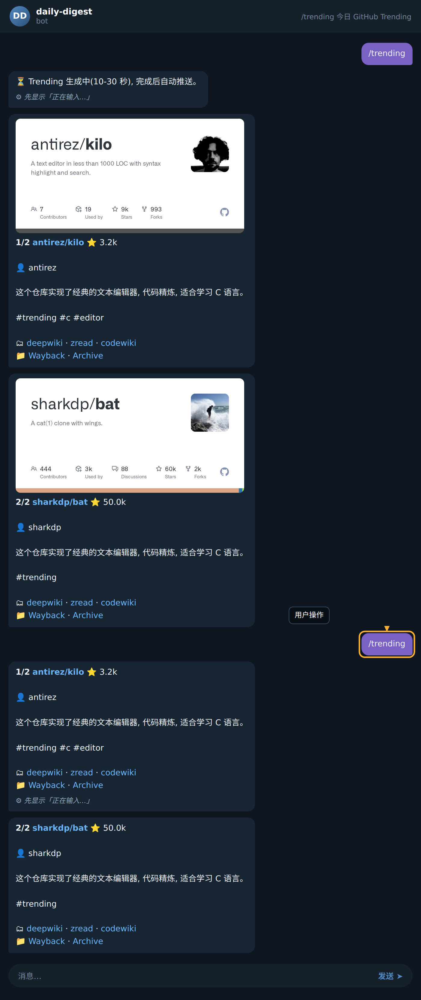

## /trending — 今日 GitHub Trending

`/trending` 是获取当天 GitHub Trending 仓库的入口命令。Bot 会优先返回缓存的卡片；若缓存不存在，会先回复一条占位提示，再由后台拉取、翻译、格式化完成后自动推送结果卡片。

### 步骤 1：发送命令

在聊天窗口输入 `/trending`（也可使用别名 `/gt`）并发送。Bot 收到请求后会立刻检查当日缓存。

### 步骤 2：等待占位提示或直接收到卡片

- **未命中缓存**：Bot 先回复一条占位消息，提示「⏳ GitHub Trending 生成中（10-30 秒），完成后自动推送」，提醒用户耐心等待，无需重复发送命令。
- **命中缓存**：Bot 立即按页返回卡片（通常每页 2 条，多页连发）。

下面以未命中场景为例，展示首轮的真实交互：

### 步骤 3：查看推送的卡片

占位消息发出后 10-30 秒，Bot 会连续推送当日的卡片。常见字段含义：

- `1/2`、`2/2`：分页序号与本页条目总数。
- `owner/repo`：仓库名（owner 与仓库）。
- `⭐ 数字`：仓库的 Star 数。
- `👤 owner`：仓库所有者。
- 正文：仓库的简要中文简介。
- `#trending` 等标签：分类与关键词。
- `🗂 <a href="...`：仓库直达链接，点击即可访问。

### 步骤 4：再次获取当日列表

当天再次发送 `/trending`（或 `/gt`），由于缓存已就绪，Bot 会直接连发卡片，不再出现占位提示，整体响应更快。

### 步骤 5：分页查看（如卡片超过一页）

若当天 Trending 数量较多，Bot 会按 `n/N` 的格式连续推送多张卡片（`n` 为当前序号，`N` 为总条目数）。逐条阅读即可，无需额外翻页指令。

### 小贴士

- **不要重复发送**：看到「⏳ 生成中」占位消息后，后台正在抓取与翻译，再次发送只会重新排队，可能延长等待时间。
- **命令别名等价**：`/trending` 与 `/gt` 行为完全一致，可按使用习惯选择。
- **链接安全**：卡片中的 `🗂 <a href=...` 指向 GitHub 官方仓库地址，可放心点击访问。
