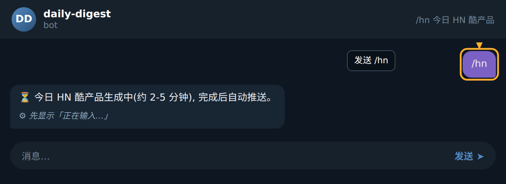
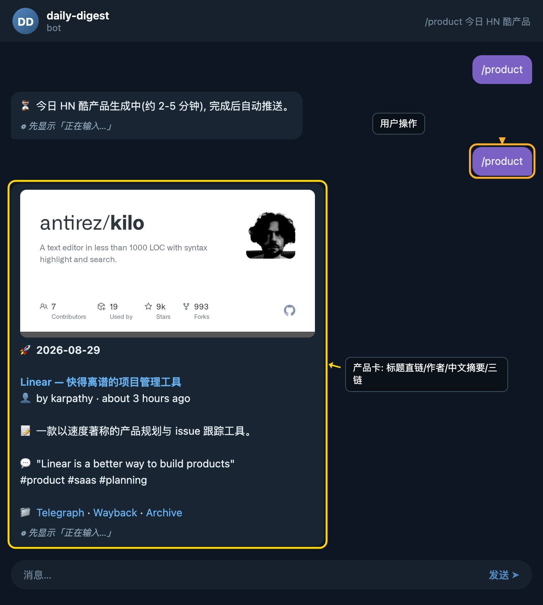

### 步骤 1：发送指令

在 Bot 对话窗口中输入 `/product` 并发送，Bot 收到后会立刻识别这是"今日 HN 酷产品"指令。

### 步骤 2：等待生成提示

首次调用时，Bot 会先在 archive 分支中查找当天的产品缓存 JSON。若命中，则秒级回传产品卡；若未命中（如新一天尚未生成），Bot 会通过 `repository_dispatch` 事件触发 GitHub Actions 工作流，去抓取 Hacker News 当日热门产品并渲染产物。由于抓取与渲染需要时间，Bot 此时会先回复一条生成中提示：

> ⏳ 今日 HN 酷产品生成中（约 2-5 分钟），完成后自动推送。

收到这条提示后，你无需重复发送指令，也无需留在原地等待。

### 步骤 3：接收产品卡

约 2-5 分钟后，Bot 会主动向你推送一张完整的产品卡。卡片中包含以下要素：

- 🚀 日期与产品名称（如 `2026-08-29 Linear — 快得离谱的项目管理工具`）
- 👤 作者与发布时间（如 `by karpathy · about 3 hours ago`）
- 📝 一句话产品简介
- 💬 原文摘要片段（通常是一段引文）
- 🖼 Open Graph 预览图（由 archive 分支中的产物提供）

如果直接看到产品卡，说明当日 archive 缓存已存在，秒级命中无需等待。

### 步骤 4：后续操作

读完产品卡后，你可以：

- 再次发送 `/product` 查看历史某一天的产品（若 Bot 支持日期参数，按提示追加即可）；
- 直接点开卡片中的链接跳转到 Hacker News 原帖讨论；
- 收藏或转发卡片，与同事分享今日发现。

### 小贴士

- 首次推送后耐心等 2-5 分钟即可，**不必重复发送** `/product`，否则会重复触发 `repository_dispatch`，延长生成队列。
- 若超过 5 分钟仍未收到推送，**先检查 archive 分支** 是否已有当日 JSON 产物；若已存在但未收到，可再发一次 `/product` 走秒回路径。
- 产品卡中的 OG 图片来源于 archive 产物，**在弱网环境下图片加载可能较慢**，建议稍候或点击图片查看原图。
