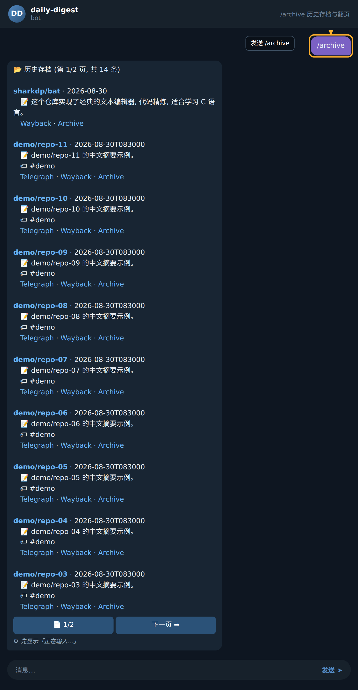
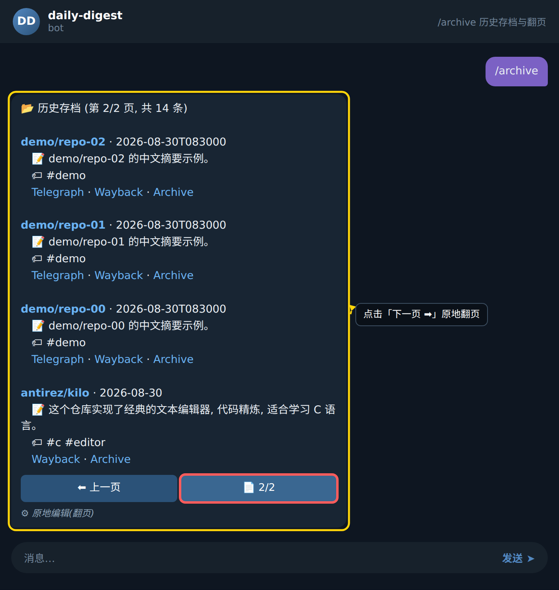

### 步骤 1：发送指令调出存档列表

在 Bot 对话窗口中输入 `/archive` 并发送。Bot 收到请求后会立即检索数据库，提取最近保存的存档条目，并按照时间倒序排列，同时附加分页信息一并返回。

页面顶部会显示一段格式化的列表标题，例如「📂 历史存档 (第 1/2 页, 共 14 条)」，告知用户当前所在页码与总条目数。标题下方依次展示每条存档，常见的字段包含：

- 仓库名称，例如 `sharkdp/bat`
- 存档日期，例如 `2026-08-30`
- 中文摘要，例如「这个仓库实现了经典的文本编辑器, 代码精炼, 适合学习 C 语言。」
- 原始链接，例如 `https://...`

此外，Bot 会在消息下方附带一个 inline keyboard 作为翻页与交互入口。

### 步骤 2：使用翻页按钮切换到下一页

在当前消息底部的 inline keyboard 中找到并点击 `▶️` 或对应的回调按钮 `arch:pg:1`，向 Bot 申请加载下一页。Bot 接收到回拨数据后会读取下一页内容，并替换当前列表消息（而非发送新消息，保持会话整洁）。

替换后的消息标题变为「📂 历史存档 (第 2/2 页, 共 14 条)」，下方展示该页的存档条目，例如 `demo/repo-02` 这类记录，附带日期 `2026-08-30T083000`、中文摘要「demo/repo-02 的中文摘要示例。」以及可选的话题标签如 `#demo` 和原始链接。此时翻页按钮的左侧会出现 `◀️`，便于用户回到上一页。

### 步骤 3：点击具体条目跳转到源链接

在任意一页的列表中，找到感兴趣的那一条存档，点击其下方的链接区域（通常为可点击的 URL 文本）。Bot 本身不会拦截跳转，而是由 Telegram 客户端负责打开浏览器，导向该存档对应的原始仓库地址，例如 `https://github.com/...`。

若需要重新查看列表，可再次发送 `/archive`，Bot 会从第一页重新开始呈现。

## 小贴士

- 每次发送 `/archive` 都会回到第 1 页，若想继续阅读上一次的位置，请优先使用 `◀️` `▶️` 翻页按钮。
- 每条存档摘要与标签由系统自动生成，可结合 `🔍` 关键词快速定位目标仓库；若未找到，可能该条目位于其他页，请尝试翻页确认。
- Telegram 的 inline keyboard 在消息发出后短时间内可点击，若长时间未操作导致按钮失效，重新发送 `/archive` 即可刷新。
