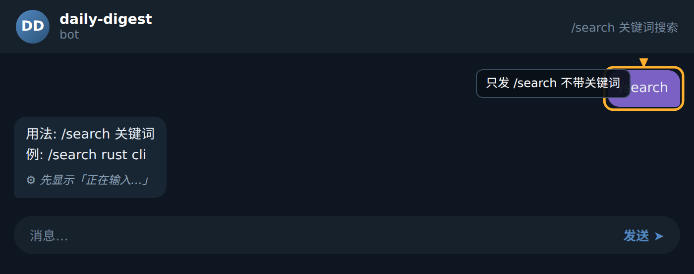
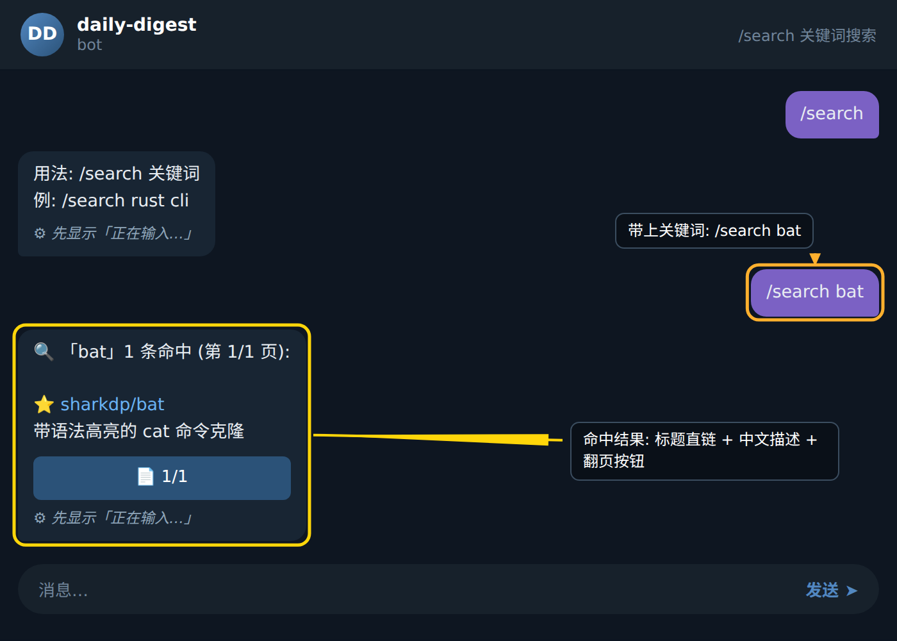

### 步骤 1: 输入不带关键词的 `/search`

直接在聊天框中输入 `/search` 并发送。Bot 会判定命令缺少必填参数,立即回复一行使用说明,提示你必须附带至少一个关键词才能进行搜索。此时不会出现任何结果卡片,只是告诉你正确的调用格式。

### 步骤 2: 输入完整命令 `/search bat`

在 `/search` 后加上空格,再写上你想查找的关键词(本例为 `bat`),然后发送。Bot 接收到完整参数后,会先在内存索引中按关键词过滤历史存档条目,再按相关度排序,最后把前若干条命中的标题连同命中统计一起封装成结果卡片回传。每条结果前会带一个 ⭐ 标记,便于快速识别高相关度的存档。

### 步骤 3: 查看 Bot 返回的结果卡片

Bot 的回复形如:`🔍 「bat」1 条命中 (第 1/1 页): ⭐ sharkdp/bat 带语法高亮的 cat 命令克隆`。该卡片包含三部分关键信息:左侧的 🔍 图标与「bat」提示你本次搜索词与命中数量;括号中的「第 1/1 页」表示当前结果总数较少,只有一页可看;冒号后面的 ⭐ 条目就是相关度最高的存档标题,直接点击即可跳转到对应详情。

### 步骤 4: 翻页(命中数大于一页时)

如果命中数超过单页容量,Bot 在结果卡片下方会附带翻页按钮。点击「下一页」按钮即可触发 `sch:page` 回调,Bot 会从 KV 存储中读取你上一次提交的查询字符串,在内存索引里取下一页数据并刷新卡片。连续点击可一直翻到最后一页;返回首页按钮则会回到第 1/1 页。整个翻页过程不需要你重新输入关键词。

### 步骤 5: 多关键词组合搜索

支持空格分隔的多个关键词,例如 `/search rust cli`,Bot 会在索引中同时匹配 `rust` 与 `cli`,相关度按命中权重累加排序,综合得分最高的结果排在最前。多关键词既能提高召回精度,也能避免单一关键词返回过多无关条目。

### 小贴士

- 关键词尽量使用英文或小写字母,可以获得更高的命中率,中文短语也能搜,但需要在存档中存在完全匹配的标题片段。
- 当命中数显示为「第 1/N 页」且 N 大于 1 时,务必用 Bot 自带的翻页按钮,手动重发 `/search` 会被视为新查询,丢失当前翻页位置。
- 如果一次搜索没有任何结果,可以尝试拆掉一个关键词再搜,或者换成更宽泛的术语,索引会立刻重新过滤并返回新的命中卡片。
